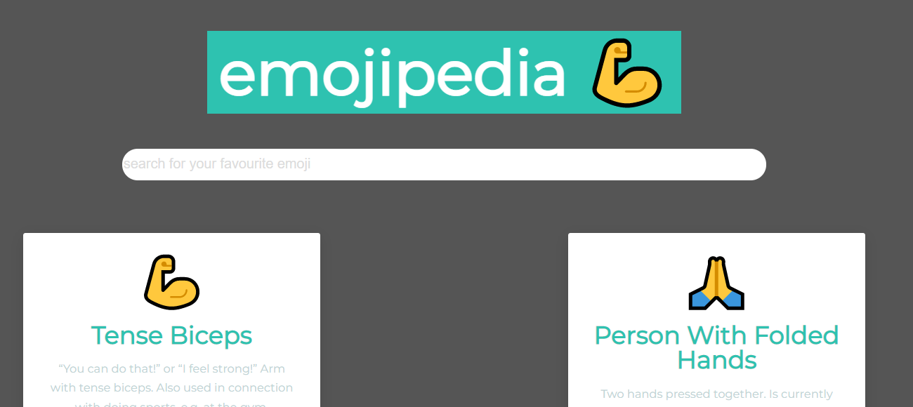

# EMOJIPEDIA

An application that allows you search your favourite emoji and give you result on the definition of each one and also allows you to filter results

## KEY FEATURES

1. Creation of my own API (EMOJIZENDIA API) that holds the structure and database of the Api
2. Using Props for components
3. Using Map, filter and reduce with simplicity
4. Using React hooks

### PSEUDOCODE

1. Create a component for Entry titled
   `Entry.js`
2. Import the necessary stuff (React, contact.js)
3. Add a map function to get data from the array
4. Map the data using a function
5. Add the filter function to enable searching for data easily
6. Using React Hooks(compulsory)
